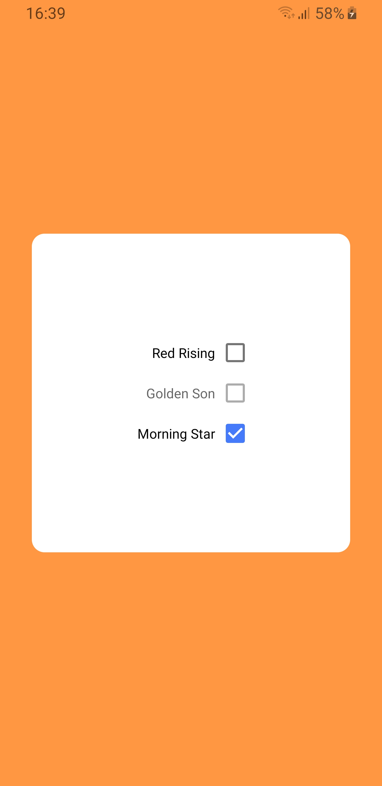
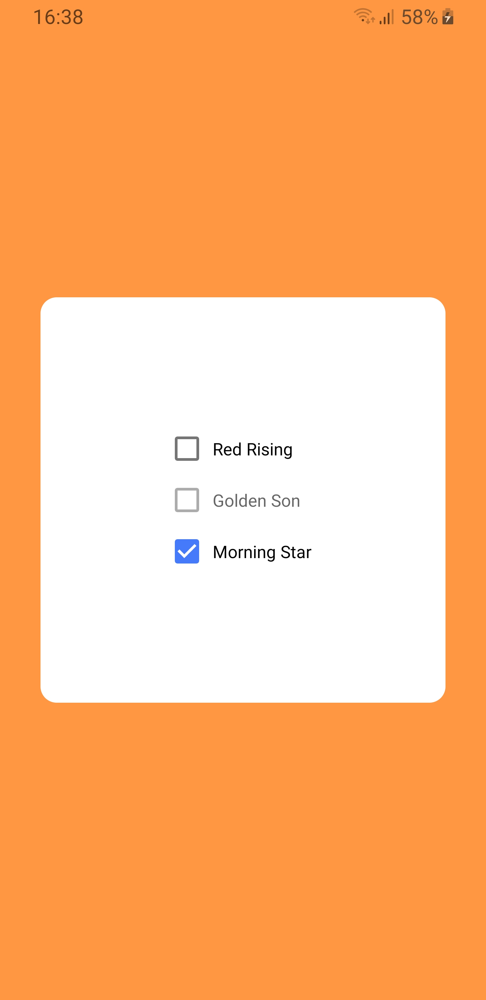

# `@react-native-form/checkbox` 🥳


[](https://www.npmjs.com/package/@react-native-form/checkbox)
[](https://www.npmjs.com/package/@react-native-form/checkbox)

React Native component used to select a single value from a range of values.

|  |  |  | 
| :---:                                      | :---:                                           | :---:                                                       |
| IOS Default                                | IOS Left Label                                  | IOS Native Component                                        |


|  |  |  | 
| :---:                                              | :---:                                                   | :---:                                                               |
| Android Default                                    | Android Left Label                                      | Android Native Component                                            |


## Getting started

`yarn add @react-native-form/checkbox`

or

`npm install @react-native-form/checkbox --save`

#### NOTE: This module must have [`react-native-vector-icons`](https://github.com/oblador/react-native-vector-icons) installed to work. 😜

## Usage

### Example

```javascript
import Checkbox from '@react-native-form/checkbox';
```

```javascript
 <Checkbox
    label="Red Rising"
    positionLabel="right"
    marginTop={0}
    nativeComponent={false}
    color="#457afb"
    disabled={false}
    checked={false}
    labelStyle={{}}
    containerStyle={{}}
    checkboxStyle={{}}
    switchStyle={{}}
    onValueChange={item => console.log(item)}
    value={13}
  />
```


### Props


| Prop name             | Description                                                                                                                     | Default         |             
| :---                  | :---                                                                                                                            | :---:           |
| ```label```           | The label of the checkbox. Can be string or componente.                                                                                                     | ```''```        |
| ```nativeComponent``` | If true the checkbox component is the Switch component, if else the checkbox is a RN component. Presents changes only on IOS.   | ```false```     |
| ```disabled```        | If true the user won't be able to toggle the checkbox.                                                                          | ```false```     |
| ```checked```         | If true the checkbox will be started active.                                                                                    | ```false```     |
| ```value```           | The value of the checkbox.                                                                                                      | ```null```      |
| ```onValueChange```   | Invoked with the new ```{ checked: boolean, label: string, value: any }``` value when the checkbox it changes.                  | ```() => {}```  |
| ```color```           | The color displayed when checkbox is on.                                                                                        | ```#457afb```   |
| ```positionLabel```   | The position of the label. Must be ```left``` or ```right```.                                                                   | ```right```     |
| ```marginTop```       | The margin top of the container.                                                                                                | ```0```         |
| ```labelStyle```      | The custom style of the label.                                                                                                  | ```{}```        |
| ```containerStyle```  | The custom style of the container.                                                                                              | ```{}```        |
| ```checkboxStyle```   | The custom style of the checkbox.                                                                                               | ```{}```        |
| ```switchStyle```     | The custom style of the switch.                                                                                                 | ```{}```        |

## License
The library is released under the MIT licence
